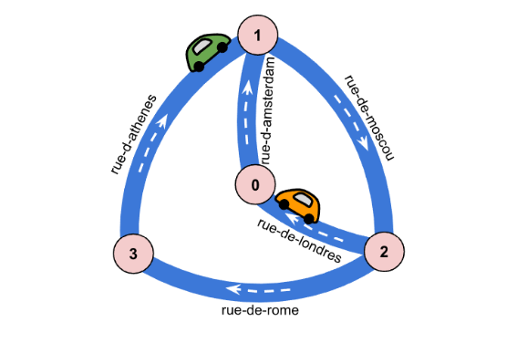

# Google-HashCode-2021

The following code was created for the Google Hash Code qualification round 2021. 

The programming language used here is Java. 

The problem statement is attached in the repository. 

The problem is as follows:

1. We have to create an algorithm to control traffic signals to ensure that traffic is managed properly provided we have the path of start and the destination for every car and we know that every path is a one way.

2. At the beginning of algorithm all the signals are red that is no car can move from one intersection to another.

3. We have to provide how many signals would we have to manipulate to achieve this target. 

4. We then have to provide the intersections all the cars visited altogather with the roads that had send incoming cars to that intersections i.e the roads the intersection is connected to.

5. Once we have all we need we can display the result using the data structure we created to read the input and we output or print it to the destination file. Both files are .txt files.

# Solution 
The code is breifly explained below. 
1. We get how many signals we need to turn green to achieve our goal is by adding all the unique values we have for the path in a set (as sets only adds unique values) and returning the size of the set.

2. To get the paths intersecting with our current intersection  we use the data structures maps. We check the ending points or the ending intersections of every intersection each car visits to count unique string of intersection names each car can come from. This provides us with the all the intersections connected to our current intersections.

3. The number of time the values occurent in the hash map is how we know the number of times there will be inncoming traffic from that intersection to our current intersection.

4. We print all the results in the destination txt file.

The Code can be run on any java complier and you may need to change the path of file for the input before running it.
The input files and the resulting output files are in the repository.

## Our solution scored 8,977,042
